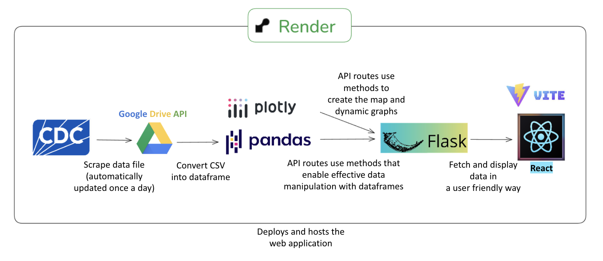

# FluFinder
FluFinder is a web app that allows users to view an interactive map or one of several charts visualizing a table of raw data provided by the CDC regarding the bird flu. The goal my team had in mind when designing FluFinder was to bridge raise public awareness, bridge the gap between raw CDC data and real-world decision making for farmers and policy makers, and to create an app that could be used to identify trends that would prevent the culling of thousands more animals.
<br>
<br>

**Project design diagram:**



## Findings with FluFinder
- Outbreaks are most commonly reported in the Northwestern US, suggesting a regional hotspot that
may benefit from increased monitoring and resource allocation.

- Approximately 60% of outbreaks affect poultry hosts, while the remaining 40% involve non-poultry hosts.

- Outbreak frequency and severity are lowest during the summer months, with July typically showing the fewest and least severe cases nationwide. This trend can help improve preparedness planning.

<br>
<br>

# Team members:

|    Username    |            Email            |
| :------------: | :-------------------------: |
|    jajajava    | ds29123@georgiasouthern.edu |
|  BlueRogue12   | sb35329@georgiasouthern.edu |
|   Kaifang02    | kf12106@georgiasouthern.edu |
|    MAaron45    | ma17700@georgiasouthern.edu |
| oscarmejia1776 | om00913@georgiasouthern.edu |
<br>

# Setting up the environment

Before running the project, ensure you have:

Python 3.10+ installed → Check by running:

```bash
  python --version
```

Git installed → Check by running:

```bash
  git --version
```

Node.js & npm (for frontend development) → Check by running:

```bash
  node -v
  npm -v

```

## Setting Up the project

1. **Clone the repository**
   Run this command in whatever directory you want the project

```bash
  git clone ---
```

## Backend Setup

2. **Create and activate a virtual environment**

```bash
python3 -m venv flu_finder_venv
source flu_finder_venv/bin/activate  # For macOS/Linux
flu_finder_venv\Scripts\Activate     # For Windows (PowerShell)
```

3. **Install dependencies**

(Includes Flask, Flask-CORS, and database dependencies)

```bash
pip install -r requirements.txt
```

4. **Set up environment variables**
   Create a .env file in the root directory and add:

```bash
DATABASE_URL=your_postgres_url_here
DOWNLOAD_PATH=flu_finder_src/data.csv
VITE_BACKEND_URL=your_url_here
SHEET_ID_SHEETNAME=google_drive_api_sheet_id
```

5. **Test the database connection**

```bash
python -c "from flu_finder_src.db import test_query; test_query()"
```

If successful, you should see:

```bash
Connected to database
Database time: YYYY-MM-DD HH:MM:SS+00:00
```

6. **Fetching the Latest CDC Data**

Before running queries, you need to **fetch the latest data** from the CDC.
The script `data_fetcher.py` downloads and saves the dataset as a local `data.csv` file inside of the `flu_finder_src` folder.

Your data should now be up to date from the CDC.

### **Running the Backend API**

To start the Flask backend, run:

~~python flu_finder_src/app.py~~
```bash
gunicorn --bind 0.0.0.0:5020 flu_finder_src.app:app
```

This will start the backend on:

➡ http://127.0.0.1:5020/

## Frontend Setup (React + Vite)

⚠️ **Make sure the backend is running before testing frontend API calls.**

1. **Navigate to the Frontend Folder**

```bash
cd flu_finder_frontend
```

2. **Install Dependencies**

```bash
npm install
```

3. **Run the Development Server**

```bash
npm run dev
```

This will start the React app, and you can access it at:
➡ http://localhost:5173/

## Additional Notes

This project uses Vite for the frontend, which provides fast hot module replacement (HMR) and optimized builds.
If you need to expand the ESLint configuration, check out:

[@vitejs/plugin-react](https://github.com/vitejs/vite-plugin-react/blob/main/packages/plugin-react/README.md)

[@vitejs/plugin-react-swc](https://github.com/vitejs/vite-plugin-react-swc/blob/main/README.md)

The backend now uses gunicorn for the production server (rather than the default dev server). Although the dev server is convenient because it auto-reloads on updates and shows errors, production servers are better because they are safer, allow more concurrent requests, and more.
If you're trying to run it as a test server, you can add the --reload flag in front of 'gunicorn' in the command. Make sure to remove it before pushing to live though- in prod you want the server to be stable and fast, not constantly watching files for updates.